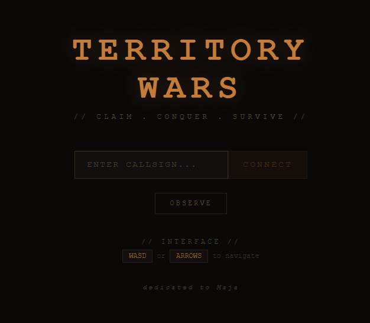
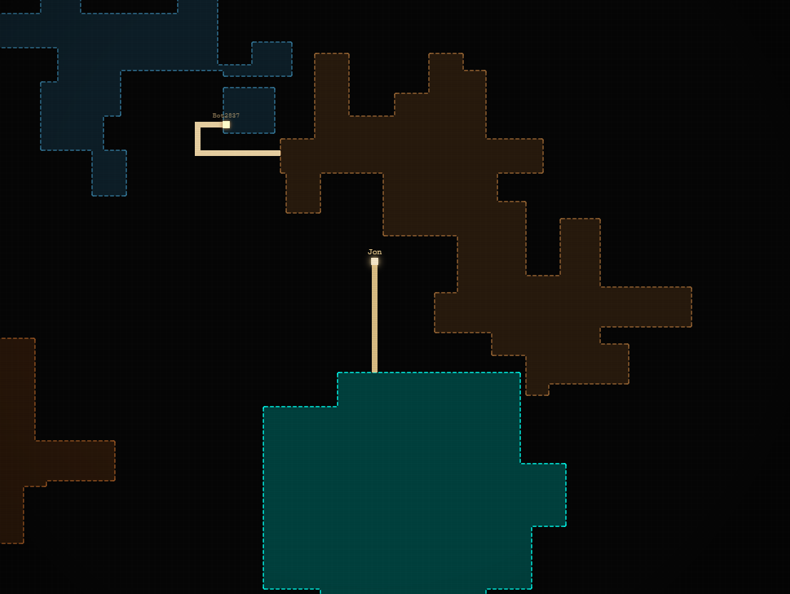

# Territory Wars

I got into computers through gaming, and have always loved spending time playing games. I started programming by building small text games with Windows `.bat` files in the early 90s. After a while I figured out that a game needs a *lot* of work — sound, graphics, and so on — things I'm just not good at. But I always come back to building small games like this one when I'm bored. And with the web knowledge I have, I really enjoy creating these little online games.

Territory Wars is a real-time multiplayer territory-capture game in the spirit of Splix.io. Carve out land on a 500×500 grid, defend your turf, and outmaneuver other players and AI bots.

<p align="center">
  
</p>

<p align="center">
  
</p>

## How it's built

- **Server** — Node.js with the `ws` WebSocket library. Authoritative game loop runs at ~22 ticks/sec, broadcasts delta updates of changed cells only, and manages up to 80 bots with their own AI (vision, danger, and chase ranges).
- **Client** — [Svelte 4](https://svelte.dev/) + [Vite](https://vitejs.dev/). Renders the grid to a canvas and talks to the server over a WebSocket.
- **Packaging** — Multi-stage `Dockerfile` builds the Svelte client, then bundles it with the Node server. The server serves both the static client files and the WebSocket on port `3099`.

The whole game is configurable from a single file: [`server/config.js`](server/config.js) — grid size, tick rate, bot count, AI tuning, etc.

## Running it

### With Docker (recommended)

```bash
docker compose up -d --build
```

Then open [http://localhost:3099](http://localhost:3099).

To stop:

```bash
docker compose down
```

### Locally (for development)

You'll need Node.js 20+.

```bash
# Terminal 1 — server
cd server
npm install
npm run dev

# Terminal 2 — client
cd client
npm install
npm run dev
```

The Vite dev server will print a local URL for the client. The server listens on port `3099`.

## TODO

- [ ] **Balance server load vs. bot count.** Need to figure out how many bots we can run at once relative to the number of human players without degrading tick rate. Right now `BOT_COUNT` is a static value in `server/config.js` — it should probably scale dynamically based on connected players and server headroom.
- [ ] **Investigate the "unknown bot" bug.** If the server runs for more than ~24 hours, an unidentified bot starts showing up in the game. Restarting the Docker container fixes it, but the root cause is unknown. Likely a state leak somewhere in the bot manager or player ID allocation.

## License

[MIT](LICENSE) © Jon Vollar
